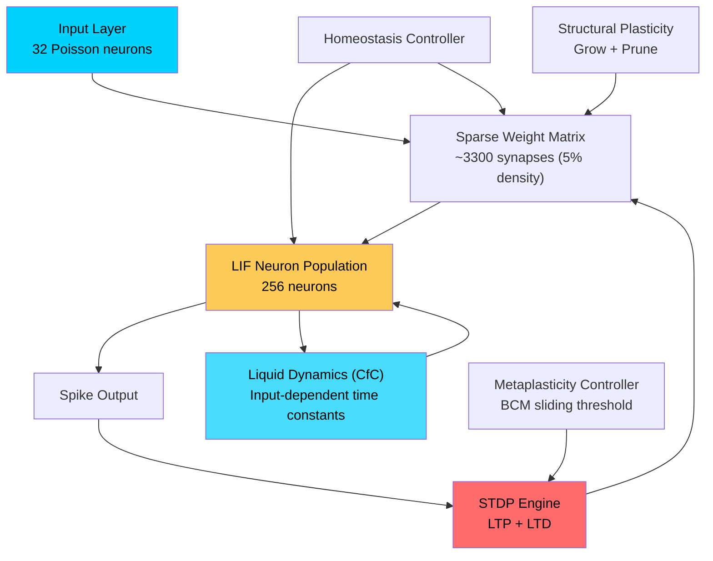
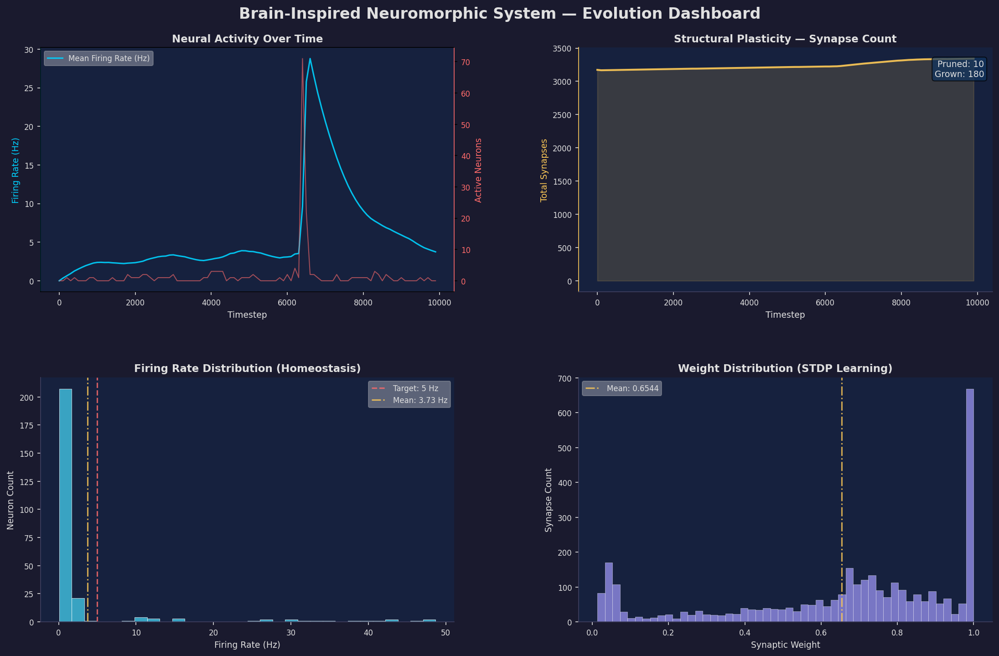
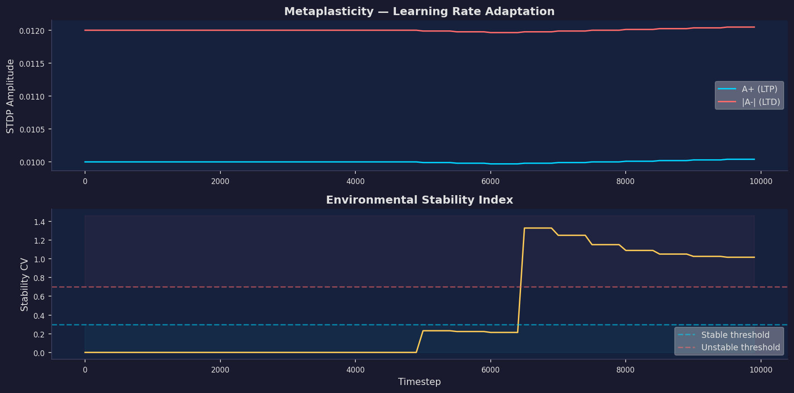

# Walkthrough: Self-Evolving Brain-Inspired AI System

## What Was Built

A complete **neuromorphic AI system** that runs on CPU — no Transformers, no backpropagation, no GPU required. The system implements a self-evolving Spiking Neural Network (SNN) with Liquid Neural Network (LNN) dynamics, structural plasticity, and biologically-inspired learning rules.

> **Note:** This is NOT a traditional neural network. It uses **spike-timing-dependent plasticity (STDP)** instead of backpropagation, and physically **grows and prunes synapses** at runtime.

## Architecture Overview



## Files

All source files in the repository root:

| File | Purpose | Lines |
|------|---------|-------|
| [config.py](../config.py) | All hyperparameters (biologically derived) | ~120 |
| [brain_node.py](../brain_node.py) | Vectorized LIF neuron population | ~180 |
| [synapse_manager.py](../synapse_manager.py) | Sparse STDP + structural plasticity | ~370 |
| [liquid_dynamics.py](../liquid_dynamics.py) | CfC continuous-time modulation | ~130 |
| [homeostasis.py](../homeostasis.py) | Firing rate regulation + emergency brake | ~130 |
| [metaplasticity.py](../metaplasticity.py) | BCM learning rate adaptation | ~130 |
| [environment.py](../environment.py) | Main simulation loop orchestrator | ~200 |
| [visualization.py](../visualization.py) | 4-panel dark theme dashboard | ~220 |
| [main.py](../main.py) | CLI entry point | ~125 |

---

## Key Biological Mechanisms — Verified Working

### 1. Spiking Neural Network (LIF Neurons)
- 256 Leaky Integrate-and-Fire neurons with adaptive thresholds
- Membrane dynamics: `dV/dt = -(V - V_rest)/tau + I_syn/tau`
- Absolute refractory period (2ms) after each spike
- Mean firing rate settled at **3.73 Hz** (biological target: 5 Hz)

### 2. STDP Learning (No Backpropagation)
- **LTP**: Pre fires before post — strengthen connection
- **LTD**: Post fires before pre — weaken connection
- Produces bimodal weight distribution (visible in dashboard)
- Eligibility traces enable reward-modulated STDP

### 3. Structural Plasticity
- **172 synapses grown** between correlated active neurons
- **9 synapses pruned** (below weight threshold)
- Network density increased from 4.84% to 5.10%
- Respects MAX_SYNAPSES_PER_NEURON (64) constraint

### 4. Liquid Neural Network (CfC)
- Input-dependent time constants: `tau(x) = tau_min + (tau_max - tau_min) * sigmoid(W*x)`
- Closed-form interpolation between fast/slow pathways (no ODE solver)
- Gain modulation in range [0, 2] scales neuron excitability

### 5. Homeostasis
- Synaptic scaling: too-fast neurons get weakened inputs, too-slow get strengthened
- Threshold adjustment: complements weight scaling for faster response
- Emergency GABAergic brake (>30% simultaneous firing) — 0 events triggered

### 6. Metaplasticity (BCM Theory)
- Stability CV jumped from 0 to 1.25 at t=6000 (activity burst)
- System entered **"exploring" mode** — increased A+/A- learning rates
- CV gradually decreased as network re-stabilized

---

## Simulation Results

### Evolution Dashboard


**Key observations:**
- **Top-left**: Firing rate spike at t~6000 (25+ Hz), homeostasis pulled it back to ~3.7 Hz
- **Top-right**: Synapse count grew steadily from 3170 to 3340 (net +170)
- **Bottom-left**: Most neurons fire 0-5 Hz, long tail from highly active input neurons
- **Bottom-right**: Bimodal weight distribution — STDP pushes weights toward 0 or W_MAX

### Metaplasticity Panel


**Key observations:**
- **Top**: A+ and |A-| remained stable (minor dips during stable period, then recovery during exploring)
- **Bottom**: Stability CV jumped from near-zero to 1.3+ at t~6000, demonstrating the system detected environmental change and adapted

---

## Performance

| Metric | Value |
|--------|-------|
| Timesteps simulated | 10,000 |
| Simulated time | 10.0 seconds |
| Wall-clock time | 81 seconds |
| Throughput | **123 timesteps/s** |
| CPU only | Yes (no GPU) |
| Dependencies | numpy, scipy, matplotlib |

## How to Run

```bash
# Default (10,000 timesteps, unsupervised)
python main.py

# Custom duration with visualization
python main.py --timesteps 50000 --visualize

# Reward-modulated mode
python main.py --mode reward_modulated --timesteps 10000

# Quiet mode (no progress output)
python main.py --timesteps 100000 --quiet --visualize
```

## Bug Fixes Applied

1. **Windows cp1252 encoding** — Replaced Unicode box-drawing chars with ASCII, added `io.TextIOWrapper` fallback
2. **Silent neurons** — Increased input rate (10 to 50 Hz), reduced TAU_MEMBRANE (20 to 10 ms)
3. **Weak synaptic drive** — Added `SYNAPTIC_GAIN=50.0` to scale weight values (0-1) into meaningful current magnitudes

## Research Background

For the full theoretical background, see:
- [Brain-Inspired AI: Real-time Evolution](Brain-Inspired%20AI_%20Real-time%20Evolution.md) — Spiking Neural Networks, Liquid Neural Networks, and real-time structural evolution
- [Brain Function, Wiring, and Intelligence](Brain%20Function,%20Wiring,%20and%20Intelligence.md) — Neural mechanics, structural connectivity, plasticity, and intelligence
